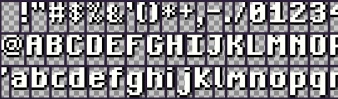

# tigrfont - bitmap font sheet generator for TIGR

`tigrfont` is a commandline tool for creating bitmap font sheets
for [TIGR] from TTF or [BDF] font files.

TIGR font sheets are simply PNG files with rows of white characters on a transparent background, separated by single-colored borders:



> This is the default font included in TIGR, and has a black drop shadow. The font sheets created by `tigrfont` don't have shadows.

## BDF to TIGR

Creating font sheets from BDF files is straightforward, since they are bitmap fonts already:
```
$ tigrfont 5x7.bdf 5x7.png
```

## TTF to TIGR

Converting from TTF files often requires a bit more testing and tweaking, depending on the specifics of the font.

Since TTF fonts are vector fonts, they are rendered to a bitmap before being exported as the final font sheet.

The rendering uses anti-aliasing, which will cause visible semi-transparent smudges at the low resolutions typically used with TIGR. 

YMMV :car:

### Font resolution and size

The font is rendered at a given dpi, by default 72.

The font size is specified in points, by default 18.

Since apparent character height for a given point size varies a lot between fonts, `tigrfont` can measure the height of an 'X' and adjust the effective point size to make the 'X' render with a height of the given point size.

For example, running
```
$ tigrfont -mx -size 20 myfont.ttf myfont.png
```
will render a font sheet at a size where a capital 'X' is 20 pixels high, since pixels equal points at 72 DPI.

## Codepage

TIGR, and `tigrfont` support two codepages, ASCII and CP-1252.
If the created font sheets use CP-1252 (the default) it should be loaded like this:

```C
Tigr* fontImage = tigrLoadImage("font.png");
TigrFont* font = tigrLoadFont(fontImage, 1252);
```

[TIGR]: https://github.com/erkkah/tigr
[BDF]: https://en.wikipedia.org/wiki/Glyph_Bitmap_Distribution_Format
